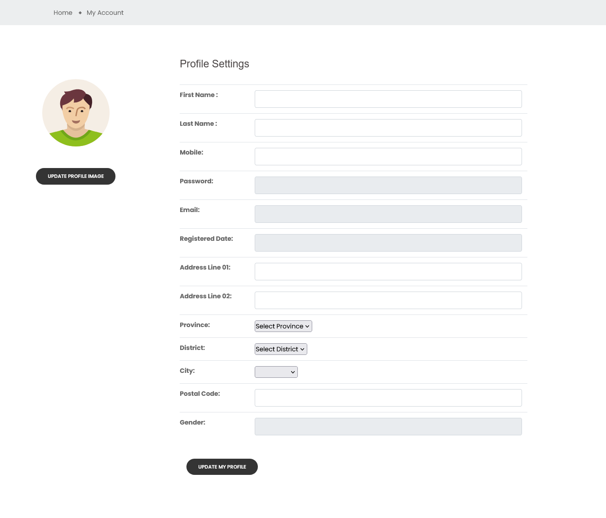

# DrodXJava - E-Commerce Web Application

**DrodXJava** is a modern Java EE e-commerce platform for selling music equipment, designed to offer a seamless and engaging online shopping experience. With a user-friendly interface and powerful backend architecture, DrodXJava simplifies online shopping for both customers and sellers.

---

## 🚀 Features

* **User Authentication:** Secure sign-up and sign-in functionality.
* **Product Catalog:** Browse and search a wide range of music instruments.
* **Shopping Cart:** Add, remove, and manage items easily.
* **Watchlist:** Save favorite items for later purchase.
* **Checkout Process:** Fast, reliable, and simple checkout experience.
* **Payment Gateway Integration:** Secure payments via the **PayHere** gateway.
* **Account Management:** Edit profile, view purchase history, and manage products (for sellers).

---

## 🛠️ Technologies Used

* **Frontend**:  HTML5, CSS3, JavaScript, Bootstrap
* **Backend**: Java EE, GlassFish Server, Hibernate ORM
* **Database**: MySQL
* **Payment**: PayHere Payment Gateway

---

## ⚙️ Installation and Setup

### Prerequisites

* Java JDK 11 or higher
* MySQL
* GlassFish Server
* Maven

### Steps

1. **Clone the repository:**

   ```bash
   git clone https://github.com/DisanduRodrigo/DrodXJava.git
   ```
2. **Import the project** into your IDE (IntelliJ IDEA / Eclipse).
3. **Set up the database:**

   * Create a MySQL database (e.g., `drodxjava_db`).
   * Update database credentials in the Hibernate configuration file.
4. **Deploy the project** on GlassFish Server.
5. **Access the app:** Open your browser and go to
   `http://localhost:8080/DrodXJava`

---

## 🧩 Overview

DrodXJava is a fully functional and responsive **Java EE e-commerce web application** tailored for a **music equipment shop**. The project emphasizes mastering backend development with **Hibernate ORM**, while maintaining an intuitive and responsive frontend.

### Core Pages

* **Sign-in Page:** Secure login for users.
* **Register Page:** Create a new user account.
* **Home Page:** Display featured and trending music instruments.
* **My Products Page:** Manage listed products (for sellers).
* **Single Product Page:** Detailed view of each product.
* **Cart Page:** Manage selected items for purchase.
* **User Details Page:** Manage personal information.
* **Add Product Page:** Upload and manage product listings.
* **Checkout Page:** Process payments via PayHere.

---

## 📄 Additional Information

This project uses a free template for the **home**, **single product**, and **shop** pages, while other pages are custom-built using **HTML**, **Bootstrap**, and **JavaScript**. The focus is on robust backend development and scalable e-commerce architecture.

## 📸 Screenshots

### Sign-in Page


### Register Page


### Home Page


### My Products Page


### Single Product Page


### Cart Page


### User Details Page


### Add Product Page


### Checkout Page


---

## 🧑‍💻 Developer

**Author:** Disandu Rodrigo
**GitHub:** [DisanduRodrigo](https://github.com/DisanduRodrigo)

---

## ⚠️ Disclaimer

This project is part of my **professional portfolio**. You are welcome to reference it, but please credit the author if you reuse or adapt any part of it.

---s

## 📜 License

This project is licensed under the **MIT License**.
See the [LICENSE](LICENSE) file for more details.
